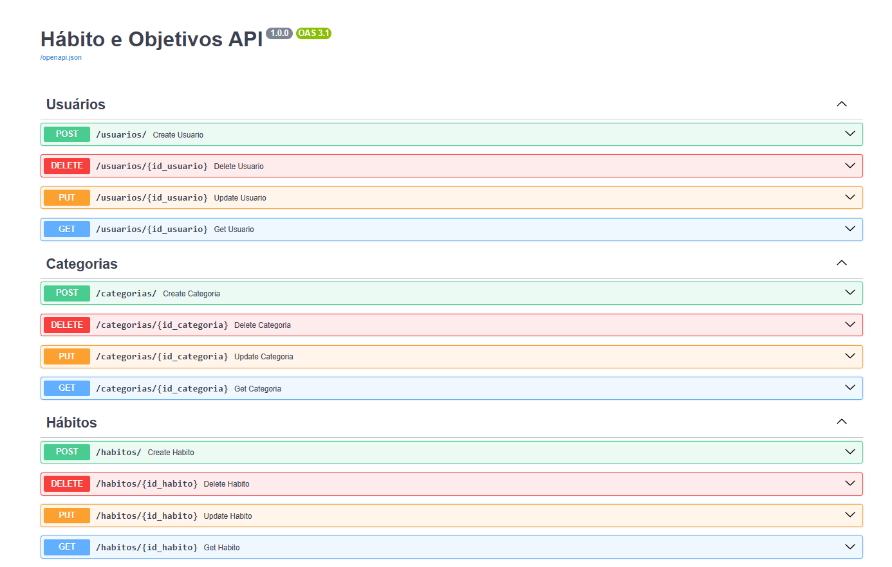
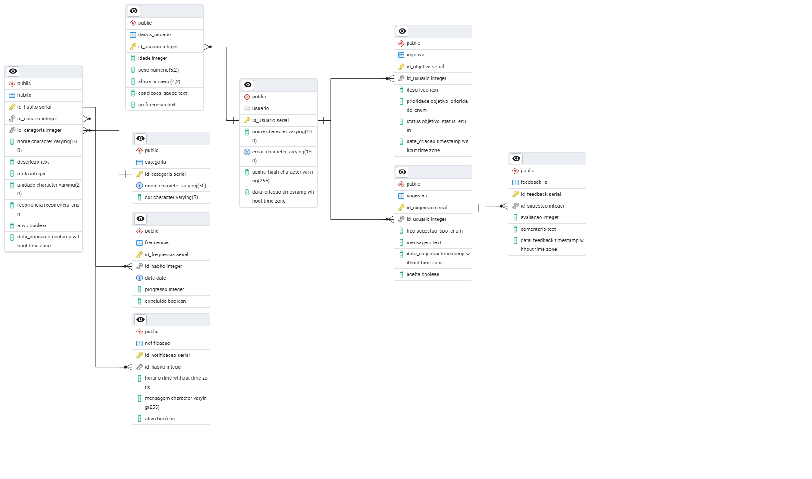

# HabitZen

[!IMPORTANT] 
Esse projeto não possui aplicação real e não é funcional! É apenas um projeto referente a disciplina de Pós-Graduação da Unifor de documentação técnica, portanto, seu foco é em documentação, não em funcionalidade!

HabitZen é um aplicativo de controle de hábitos que ajuda a transformar metas diárias em rituais saudáveis, com recomendações personalizadas e acompanhamento inteligente para uma vida mais equilibrada e produtiva.

## Descrição

HabitZen é um aplicativo que permite aos usuários monitorar seus hábitos diários, definir metas e receber sugestões personalizadas para melhorar sua saúde e bem-estar.

## Funcionalidades

- **Cadastro de Usuários**: Os usuários podem se registrar e gerenciar suas informações pessoais.
- **Gerenciamento de Hábitos**: Crie, edite e exclua hábitos, definindo metas diárias e recorrências.
- **Notificações**: Receba lembretes para cumprir seus hábitos.
- **Relatórios de Progresso**: Visualize seu progresso ao longo do tempo.
- **Sugestões Personalizadas**: Receba sugestões de novos hábitos e melhorias com base em seu desempenho.

## Tecnologias Utilizadas

- **Backend**: FastAPI
- **Banco de Dados**: PostgreSQL
- **ORM**: SQLAlchemy
- **Validação de Dados**: Pydantic

## Swagger


## Esquema DER


## Pré-requisitos

- Python 3.11 ou superior
- UV
- Docker

## Instalação

1. Clone o repositório:
   ```bash
   git clone git@github.com:Artoshk/habitzen.git
   cd habitzen
   ```

2. Crie um ambiente virtual e ative-o:
   ```bash
   uv run src/main.py
   ```

3. Configure o banco de dados no arquivo `docker-compose.yaml` e inicie os serviços:
   ```bash
   docker-compose up -d
   ```

4. Acesse a aplicação em `http://localhost:8000/docs`.

## Testes

Este projeto inclui testes de da API e de performance utilizando o K6. Os testes realizam operações CRUD em várias entidades e ajudam a monitorar o desempenho da aplicação.

Para executar os testes de performance, consulte o README no diretório `k6`.

## Uso
- Para criar um novo usuário, faça uma requisição POST para `/users`.
- Para gerenciar hábitos, utilize os endpoints relacionados a hábitos.

## Contribuição

Contribuições são bem-vindas! Sinta-se à vontade para abrir um issue ou enviar um pull request.

## Licença
Este projeto está licenciado sob a MIT License - veja o arquivo [LICENSE](LICENSE) para mais detalhes.
